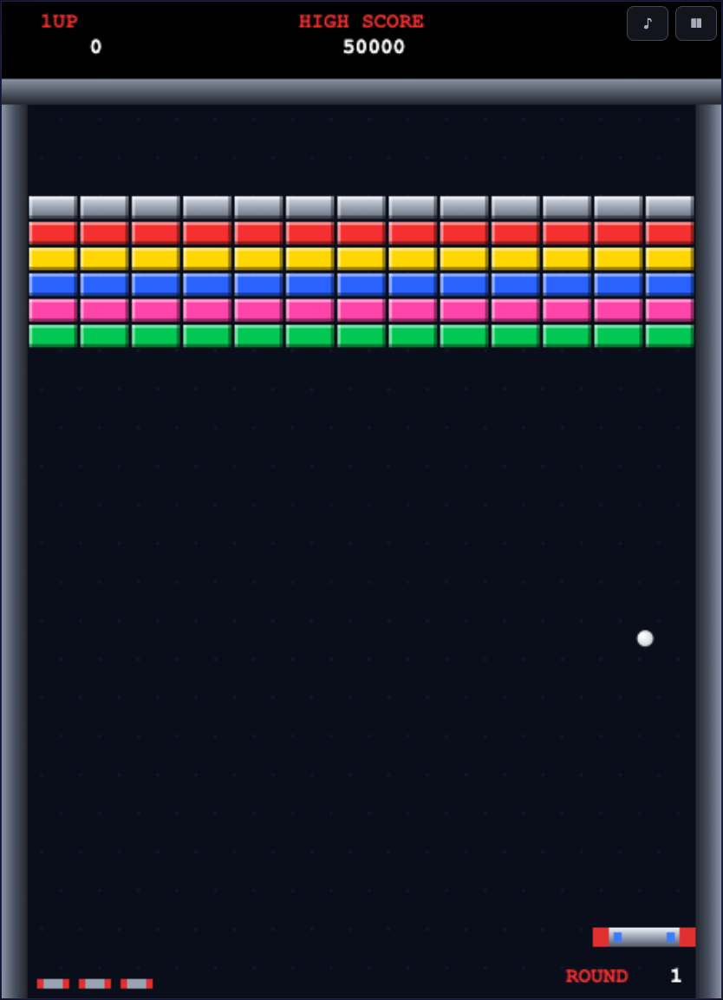
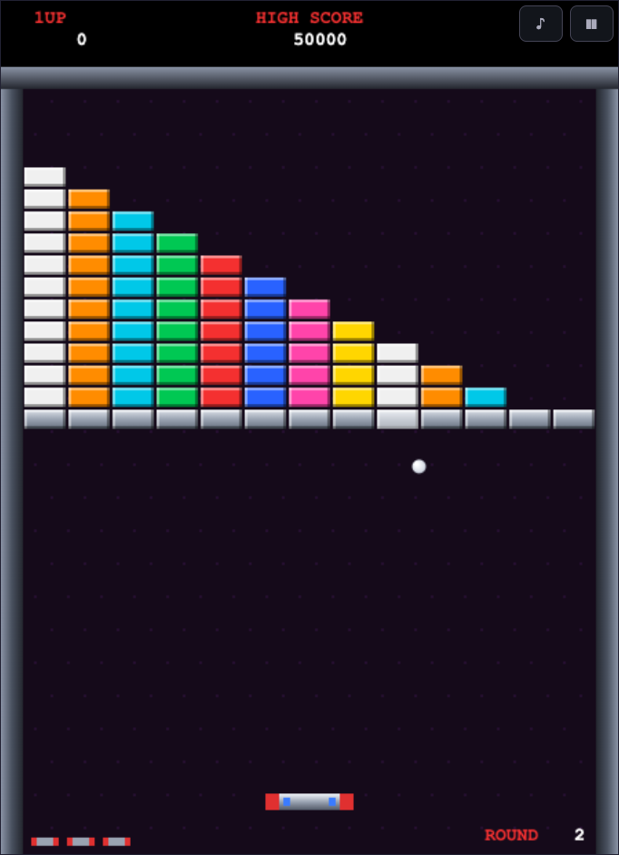
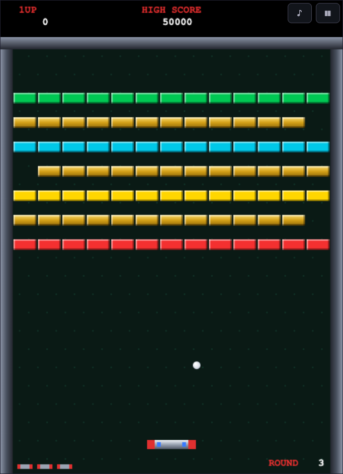
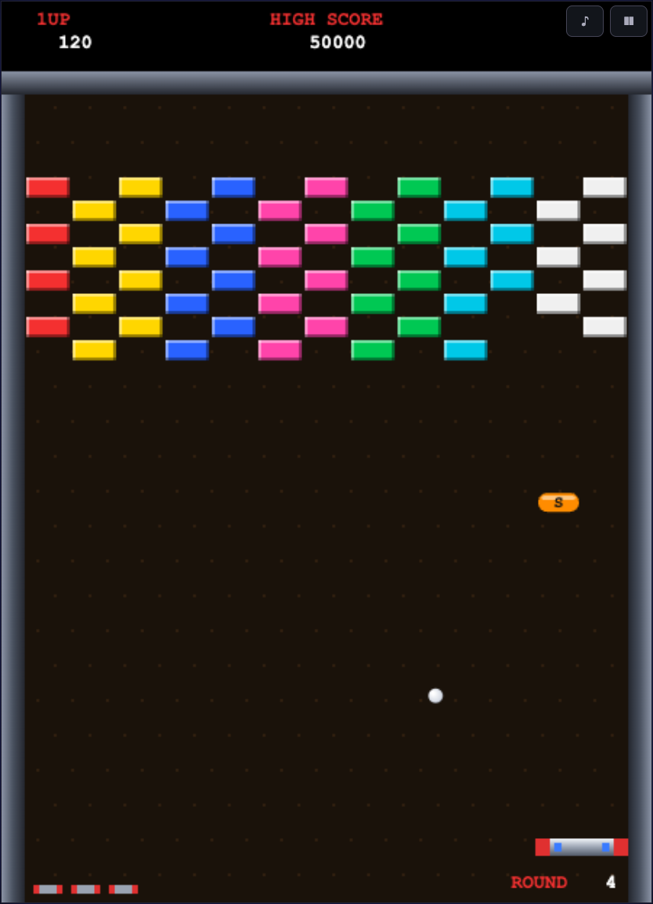
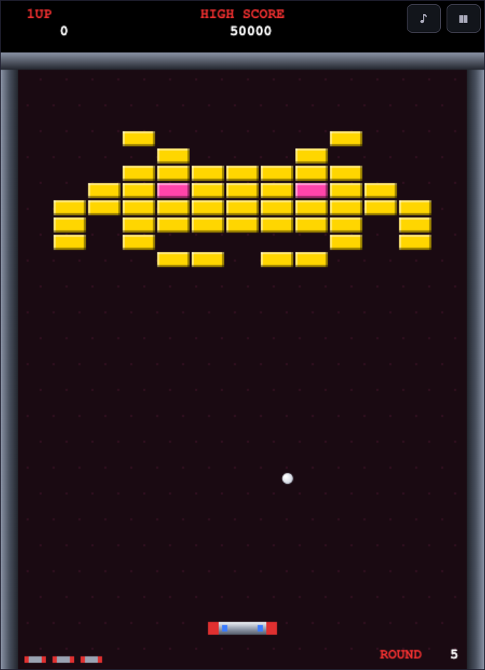
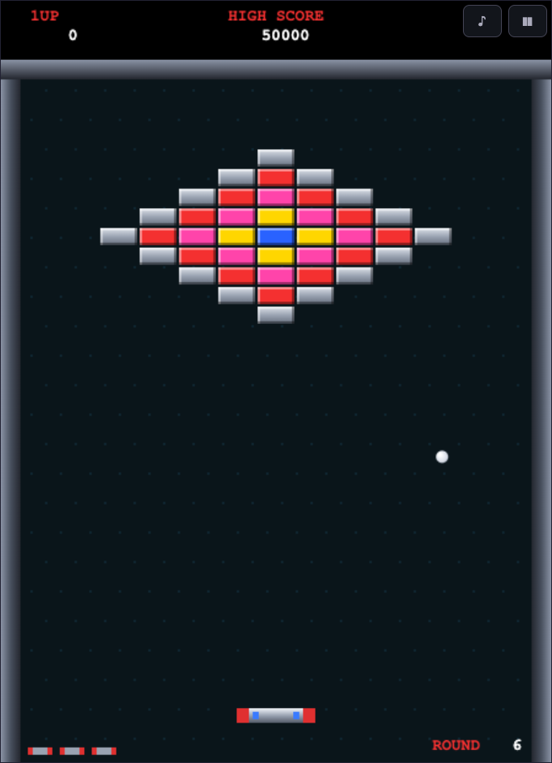
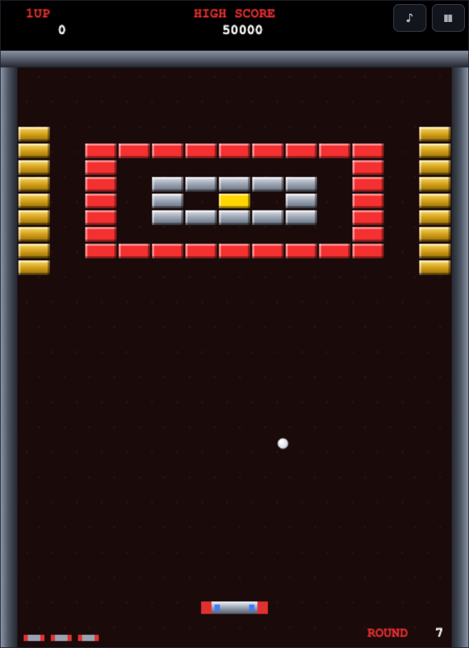
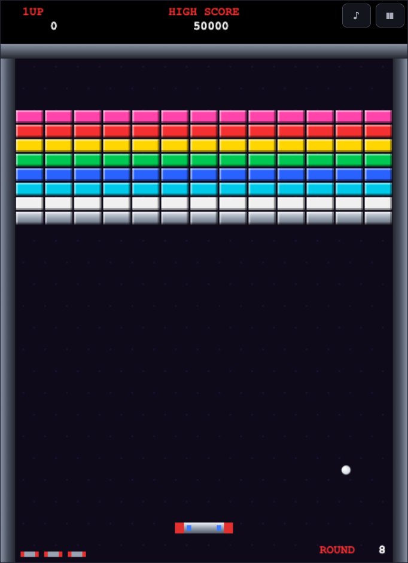

# BRICK BREAKER — Arkanoid Style

タイトーの名作「アルカノイド」へのオマージュとして作った、ブラウザで動くブロック崩しゲームです。
ライブラリ・ビルド不要の素の HTML + Canvas + JavaScript で実装しています。

## ▶ 今すぐ遊ぶ

**https://keimei-yoritaka.github.io/brick-breaker-arkanoid/**

インストール不要。上のリンクを開くだけでブラウザでそのまま遊べます。

## 遊び方

`index.html` をブラウザで開くだけで遊べます。ローカルサーバーを使う場合:

```sh
python3 -m http.server 8026
# → http://localhost:8026 を開く
```

### 操作

| 操作 | 入力 |
| --- | --- |
| バウス（パドル）移動 | マウス / ← → キー / タッチ（画面 or 画面下部の操作エリア） |
| ボール発射・レーザー | クリック / スペース / タップ |
| ポーズ | P / 画面右上の ❚❚ ボタン |
| BGM オン/オフ | 画面右上の ♪ ボタン |

タッチ端末ではゲーム画面が少し縮小され、画面下部に専用の操作エリアが表示されます。
指でゲーム画面（バー）を隠さずに操作できます。

## ゲーム要素

- **ブロック**: 色ブロック（1発 / 50〜120点）、シルバー（複数発 / 50×ラウンド点）、ゴールド（破壊不可）
- **反射角**: バウスのどこに当てたかでボールの跳ね返る角度が変わる
- **ラウンド**: 全8面（元祖1面・階段・ゴールドの梁・インベーダーなど）。クリア後はループし、速度とシルバー耐久が上昇
- **スコア**: 20,000点で残機+1、以降も一定スコアごとに追加。ハイスコアは localStorage に保存
- **BGM**: `resources/うさぎのカフェテリア.mp3`（[DOVA-SYNDROME](https://dova-s.jp/) 提供のフリーBGM）があればそれを再生します。同サイトの規約により音源の再配布が禁止されているためリポジトリには含めておらず、ファイルがない環境（公開版を含む）では Web Audio 合成のオリジナル・チップチューンを自動的に再生します。♪ ボタンでオン/オフでき、設定は保存されます

### パワーアップカプセル

| カプセル | 効果 |
| --- | --- |
| **S** SLOW | ボールが遅くなる（徐々に元へ戻る） |
| **C** CATCH | ボールをバウスでキャッチできる |
| **E** EXPAND | バウスが大きくなる |
| **D** DISRUPT | ボールが3つに分裂 |
| **L** LASER | スペース/クリックでレーザー発射 |
| **B** BREAK | 即座に次のラウンドへ（+10,000点） |
| **P** PLAYER | 残機が1機増える |

## ファイル構成

```
index.html      エントリポイント
css/style.css   画面レイアウト
js/game.js      ゲーム本体（ループ・物理・描画・効果音すべて）
```

効果音・BGM は Web Audio API でリアルタイム合成しているため、音声ファイルはありません。

開発用に、URL に `?round=N` を付けると指定ラウンドから直接開始できます（例: `index.html?round=5`）。

## ステージ一覧（全8面）

全部で8面あります。ROUND 8 をクリアすると ROUND 1 に戻り、ボール速度とシルバーブロックの耐久が上がった周回プレイになります。

| ROUND 1 — 元祖1面 | ROUND 2 — 階段 |
| :---: | :---: |
|  |  |
| **ROUND 3 — ゴールドの梁** | **ROUND 4 — 市松模様** |
|  |  |
| **ROUND 5 — インベーダー** | **ROUND 6 — ダイヤモンド** |
|  |  |
| **ROUND 7 — 要塞** | **ROUND 8 — 虹の最終面** |
|  |  |
